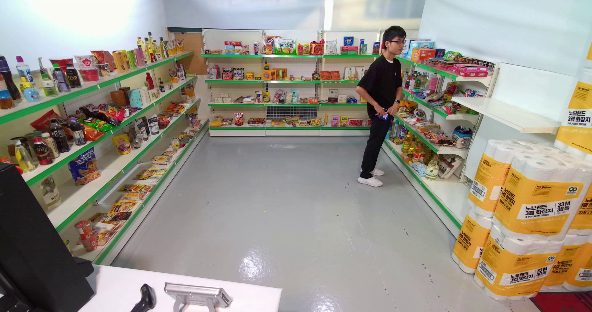

# resnet50 + conv3d LSTM을 이용한 절도탐지 시스템 과제

# 데이터 : aihub의 실내사람 이상행동 데이터(https://www.aihub.or.kr/aihubdata/data/view.do?currMenu=115&topMenu=100&aihubDataSe=data&dataSetSn=71550)
* google colab에서 진행한 관계로 동영상 데이터는 6개만 뽑아서 활용
* 데이터는 각 프레임별로 사진을 가져와 저장후 3프레임씩 학습 시키기위해서 3프레임씩 묶음
* 라벨링은 xml파일의 theft start,end 태그를 사용해 절도 시작과 끝의 데이터를 가져와 라벨링

# 트러블 슈팅
* 과제 진행 학습을 진행할때 accuracy가 계속 일정하게 나오는 문제가 있었음
-> 학습률 그리고 데이터 클래스 불균형의 문제
### 학습률을 더 작게 조정, 그리고 절도라벨링된 파일 개수와 동일하게 파일을 랜덤샘플링하여 학습을 진행
